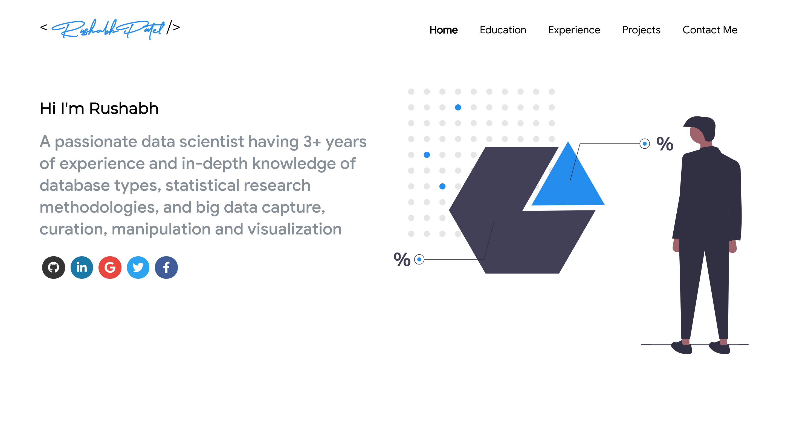

# Personal Website Portfolio   

## A clean, beautiful and responsive portfolio template for Developers!

  <kbd>
  	<a href="https://ashutosh1919.github.io" target="_blank">
		</img>
	</a>
  </kbd>

 

If you want to **contribute** and make this much better for other developer have a look at [Issues](https://github.com/rushabh31/rushabh31.github.io/issues).

If you created something awesome and want to contribute then feel free to open Please don't hesitate to open an [pull request](https://github.com/rushabh31/rushabh31.github.io/pulls).

## Sections
✔️ Home \
✔️ Education \
✔️ Experience\
✔️ Projects \
✔️ Contact me
 
To view a live example, **[click here](https://rushabh.info/)**

## Technologies used 🛠️

- [React](https://reactjs.org/)
- [graphql](https://graphql.org/)
- [apollo-boost](https://www.apollographql.com/docs/react/get-started/)

## illustrations
- [UnDraw](https://undraw.co/illustrations)

## Deployment 📦
Once you have done with your setup. You need to put your website online!
I highly recommend to use [Github Pages](https://create-react-app.dev/docs/deployment/#github-pages) to achieve this on the EASIEST WAY

## License 📄

This project is licensed under the MIT License - see the [LICENSE.md](./LICENSE) file for details
